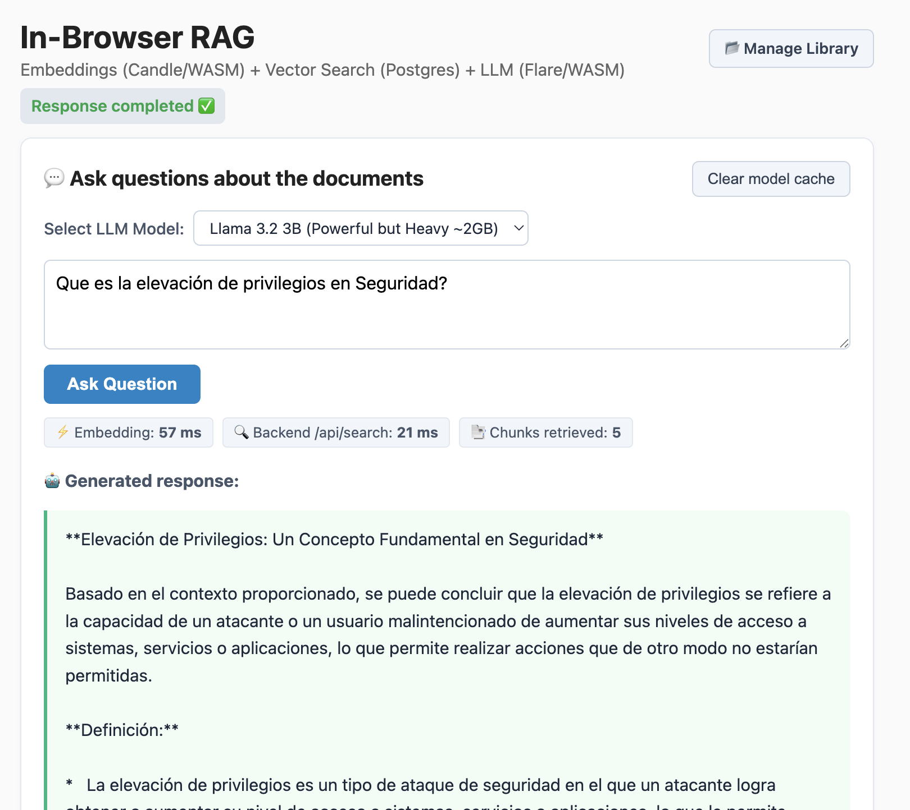

# In-Browser RAG (Rust + WASM)

An efficient RAG (Retrieval-Augmented Generation) prototype where both **Query Embedding (Candle/WASM)** and **Response Generation (WebLLM/WASM)** run **entirely in the user's browser**. The backend behaves strictly as a lightweight, fast vector search engine: it receives a vector, executes a kNN query, and returns the top chunks, without running any heavy LLM.

<p align="center">
  
</p>

---

## Architecture

```
User writes a query
      │
      ▼
[embedder.js]  → Candle WASM (crates/embedder) → 384-dim Vector Embedding
      │
      ▼
POST /api/search  { embedding, top_k }   ← Only network traffic per turn
      │
      ▼
Backend: kNN Search on Postgres + pgvector → { chunks }
      │
      ▼
[main.js] builds the rich context prompt using retrieved chunks
      │
      ▼
[generator.js] → WebLLM (GGUF, WebGPU / CPU Fallback) → Streaming Response
```

Model weights are downloaded only once and stored locally in the browser using the **Cache API** (`www/modelCache.js`). Subsequent visits retrieve the models instantly from local disk.

---

## Component: Async Loader (rag-loader)

To keep the Backend lightweight and free of heavy machine learning dependency overhead, all PDF indexing has been extracted to a standalone service: `Loader`.

### How it works:
1. **Directory Watch**: Monitors the `input/` folder for new `.pdf` files.
2. **Auto-Clean & Deduplication**: If an indexed document with the same filename is dropped again, the Loader automatically cleanses the database (deleting old chunks and fallback original entries) and deletes old physical files to prevent duplication and junk data.
3. **Extraction & Classification**: Extracts text page-by-page from the PDF using `lopdf`. It classifies the document dynamically into categories and subdomains (e.g., `Technology, Science and Computing`, `AI`, `DEV`).
4. **Chunks & Embeddings with Live Progress**: Fragments text into larger semantic chunks (**size: 1000 chars, overlap: 150 chars**). Generates L2-normalized vector embeddings using a local multilingual model, displaying a clean progress bar in the terminal console.
5. **Database Sync**: Inserts original PDF data into the database and saves all text chunks alongside their 384-dimensional vectors.
6. **Final Transfer**: Copies the processed PDF file to the shared `files/` output folder for the Backend to serve when requested by the Frontend, and safely purges the original from `input/` (fully cross-device/volume compatible).

---

## Component: Document Library Manager

A professional multi-page interface has been integrated into the frontend (`www/documents.html`) to manage your library independently from the main chat:
* **Interactive Live Search**: Filter the indexed documents by filename as you type.
* **Alphabetical Filter (A-Z)**: Click any letter to immediately find documents starting with that character.
* **Pagination (10 per page)**: Clear, clean, and fast navigation for massive libraries.
* **Metadata & Summary**: View each document's chunk count, its categories, and a dynamically generated summary/preview.
* **Total Deletion**: Single-click deletion which transactionally deletes all vector embeddings from Postgres and deletes its physical file from disk.

---

## Deployment with Docker Compose (Recommended)

The project includes a complete multi-container setup with auto-initialization.

⚠️ **CRITICAL DEPLOYMENT NOTE**:
To avoid compiling Rust and Node build environments inside Docker (which slows down deployment and raises sandbox issues), **the frontend build assumes that the embedder WASM package has already been compiled on your local host**.

Always compile the WASM locally before starting or rebuilding Docker Compose:

```bash
# 1. Compile the WASM package on your host (takes ~1 second):
cd crates/embedder
wasm-pack build --target web --release
cd ../..

# 2. Start deployment using Docker Compose:
docker compose up -d --build
```

### Services included:
1. **`db` (`pgvector/pgvector:pg16`)**:
   - PostgreSQL with `pgvector` extension.
   - Automatically runs migrations and schema from `backend/migrations/001_init.sql`.
   - Local persistent host directory: `${HOME}/Data/rag-browser/database`.
2. **`backend` (Rust / Axum)**:
   - Extremely lightweight API service. No heavy AI models.
   - Performs kNN vector query and serves PDF files.
   - Local persistent directory: `${HOME}/Data/rag-browser/files` and `/input`.
3. **`loader` (Rust / Candle Multilingual)**:
   - Watches `/input` directory, processes PDFs, displays terminal progress bar, and inserts vectors.
4. **`frontend` (Nginx + WebLLM + Candle WASM)**:
   - Served on `http://localhost:3000` (or `http://localhost:80`).
   - Reverse proxies `/api` to the backend seamlessly avoiding CORS issues.

---

## Multi-Language Embedding Models (Improvements & Guidelines)

By default, the system is configured with the multilingual model **`sentence-transformers/paraphrase-multilingual-MiniLM-L12-v2`** on both the **Loader** (server-side indexing) and the **Frontend** (client-side query embedding).

### Why this model?
* **Dimension 384**: Compatible out of the box with the default database schema without altering columns.
* **Highly lightweight (~115MB)**: Downloads instantly in the browser.
* **Native Catalan, Spanish, & English support**: It matches semantics across languages. You can index an English document and query in Spanish/Catalan, and pgvector will retrieve the exact English passages.

### Recommended Alternatives:

1. **`intfloat/multilingual-e5-small`**
   - **Dimension**: 384
   - **Performance**: High semantic accuracy. For optimal results, add the prefix `"passage: "` during indexing and `"query: "` to user queries.
2. **`BAAI/bge-m3`**
   - **Dimension**: 1024 (Requires altering Postgres database column to `vector(1024)`).
   - **Performance**: Maximum enterprise accuracy, though heavier download size (~560MB) for browsers.

---

## Production Models (LLM)

Supported WebLLM models can be dynamically swapped in the UI dropdown:
* **Default**: `Llama-3.2-1B-Instruct` (Fast and Smart, ~750MB).
* **Alternatives**: `Qwen2.5-0.5B-Instruct` (Ultralight, ~350MB), `Qwen2.5-1.5B-Instruct` (Excellent balance, ~1GB), `Llama-3.2-3B-Instruct` (~2GB).

---

## Security Disclaimer & Scope

This project is a **Proof of Concept (PoC)** and is intended solely for local testing and research purposes.
* **No Authentication/Authorization**: The system does not implement any layer of user authentication, session control, or authorization (RBAC) to restrict access to API endpoints or the Document Library Manager.
* **No Communication Security**: Network channels, file transfers, and database connections are unencrypted by default and do not employ HTTPS/TLS certificates.
* **Safety Scope**: Do not deploy this project in public production environments without implementing a reverse proxy with TLS/SSL encryption, robust API gateway firewalls, authentication layers, and sanitization filters.

---

## Collaborators

* **Jordi Castells** (Main developer)
* **GitHub Copilot** running **Google Gemini 3.5 Flash** (AI pairing assistant & co-architect)

---

## License

This project is licensed under the **MIT License**. See the [LICENSE](LICENSE) file for details.

